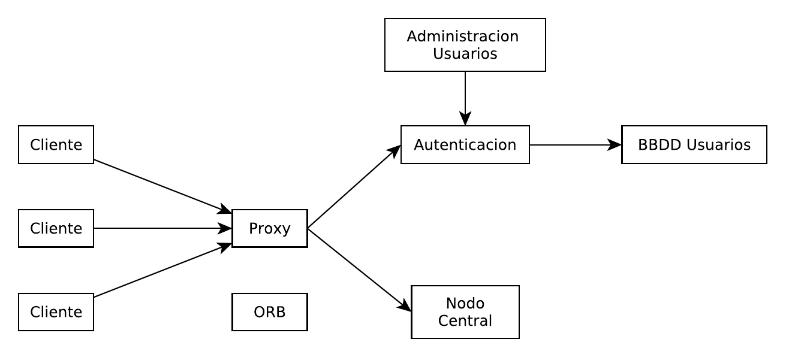
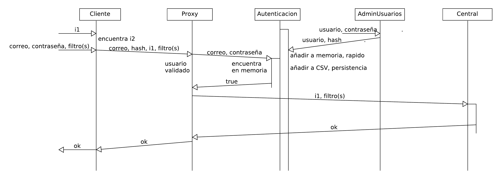
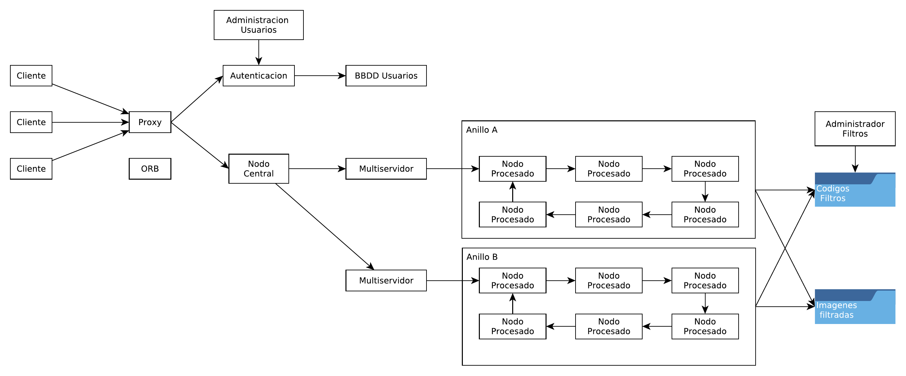
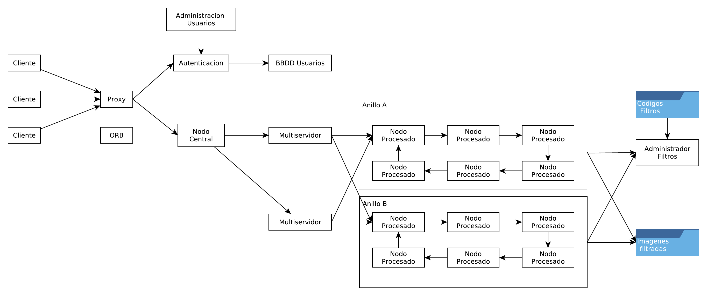
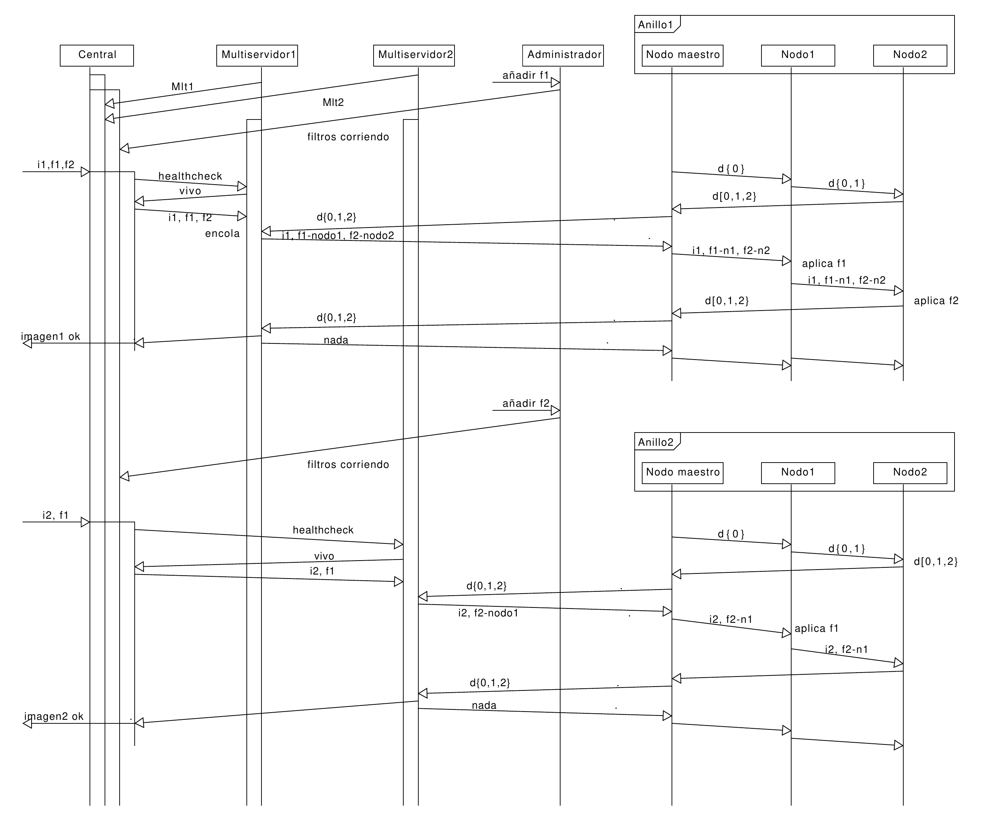
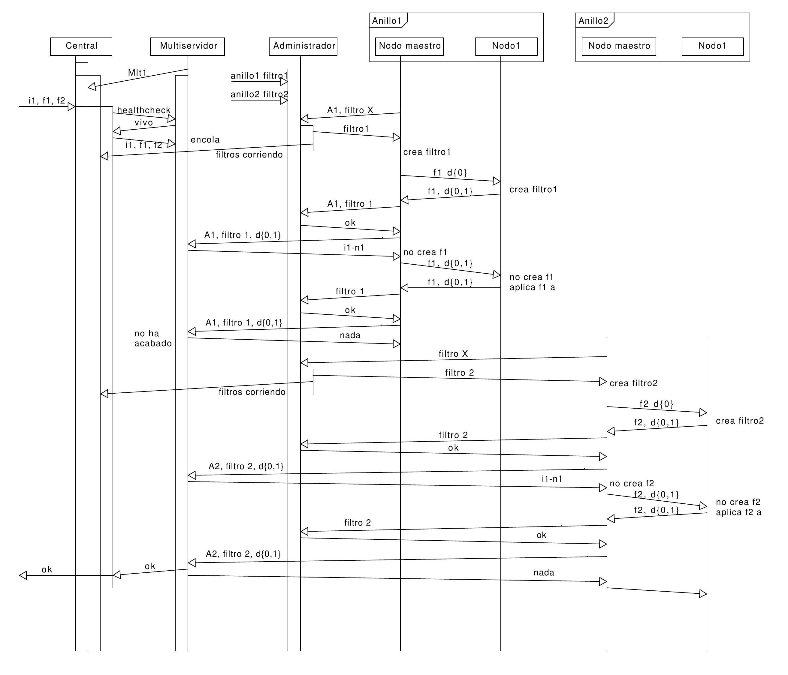
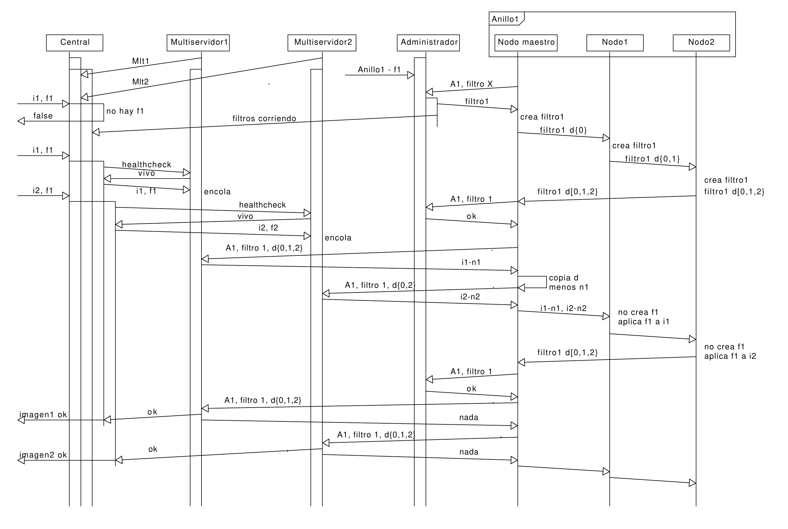

# Introducción
El sistema está implementado en script de bash, java y python. He utilizado Docker para montar los nodos del sistema. El despliegue implica: ompilar el código fuente; instalar el sistema; y ejecutarlo. Estos tres pasos tienen scripts de shell para automatizar el desarrollo y espliegue. Python es usado exclusivamente para aplicar filtros a imagenes. La comunicación está implementada en java. Para los directorios remotos he usado SAMBA, explicaré la razón de esta decisión más adelante.

## Funcionamiento del sistema
El sistema tiene dos versiones, pero solo cambian en los nodos y elementos especificos a cada variante. Los elementos en común son: Cliente; Proxy; Nodo de autenticación; Administrador de Usuarios; y Nodo Central. Hay un CSV con los datos de los usuarios para asegurar la persistencia, este solo es accedido por el nodo de autenticación, y es también común a las dos variantes. El directorio remoto solo aparece en los diagramas de los sistemas, pero es el mismo para los dos.

Siguiendo el orden cronológico de una petición, el primer nodo a describir es el cliente. Este programa solo tiene un único hilo, y se queda bloqueado. Antes de lanzar el programa java titular, el nodo necesita montar el directorio remoto de las imágenes. Teniendo el directorio remoto montado, el usuario del cliente tiene que copiar de un directorio local al remoto la imagen a la que quiere que se le aplique el filtro. Con la imagen lista, se puede ejecutar el programa. Este muestra al usuario un dialogo por consola en el que se le piden: direccion relativa y nombre de la imagen; el correo de usuario con el que está registrado; su contraseña; y el filtro o lista de filtros que quiere aplicar, separados por comas.

 El programa Cliente.java tiene una medida contra fallos, un bucle hasta que el usuario introduzca un nombre de imagen que exista en la carpeta distribuida. El sistema tiene mas medidas contra fallos introducidos por el usuario, pero están implementadas en otros programas. Después de introducir los filtros se crea un hash con la contraseña del usuario, para nunca llegar a enviar esta en claro. Los campos que ha introducido el usuario se envı́an a Proxy usando CORBA, justificaré esta decisión en la sección de heterogeneidad. 
 
 El siguiente nodo es Proxy. Este recibe una llamada remota al método getFiltrado con los campos del usuario. Los dós primeros, correo y hash de la contraseña son enviados al nodo de autenticación. Este responde con un booleano, si el usuario existe y su contraseña concuerda, o no. En caso negativo, la petición del cliente acaba aqui, devolviendole un false como resultado. Si el usuario se autentica, la petición se propaga al nodo central. Durante el diseño pensé que proxy lanzara un hilo por cada petición que le llega, pero en la implementación asumı́ equivocadamente que CORBA lo generarı́a automaticamente, cuando necesita ser explı́cito. 
 
 Es necesario para la comunicación entre Cliente y Proxy que este disponible un broker, este corre en un tercer nodo.

La comprobación de los credenciales del usuario es manejada por el nodo de autenticación. A este también se conecta el administrador de usuarios. Al arrancar, carga un CSV en el que están guardados los usuarios y los hash con sus contraseñas. Este programa tiene 2+N hilos, siendo N el numero de peticiónes del proxy simultáneas (esta implementado asumiendo un proxy capaz de varios hilos). En el primer hilo escucha peticiones del proxy, en el segundo del administrador. Las del último son adiciones o eliminaciones de usuarios. Para reflejar los cambios que ordene el administrador rápido, son primero aplicados en el objeto en memoria donde están los credenciales, y después hechos persistir en el CSV. 

El admnistrador de usuarios tiene dos medidas a resaltar. La primera es, igual que el cliente, la conversión de la contraseña a un hash antes de ser enviada. La segunda una protección frente a errores del administrador. Para poder crear un usuario el correo tiene que seguir una expresión regular con el patrón de un correo. Solo se envı́a a autenticación un usuario para crear después de que el correo introducido cumpla el patrón. 

Los nodos Proxy, Autenticación y Administrador de usuarios se sincronizan al arrancar. Usando el algorı́tmo de Cristian en un bucle de diez peticiones, se calcula una corrección. Autenticación se sincroniza con Administrador de usuarios y Proxy con Autenticación. Proxy además recibe la corrección de Autenticación respecto a Administrador de usuarios, y guarda la corrección acumulada entre el y el administrador. 

Por último, el nodo central. Este tiene 3+N hilos. El primero es en el que escucha las peticiones de proxy, igual que el nodo de autenticación, esta programado para pasar el proceso de la petición a un trabajador, de manera que sea solo este el que se bloquea durante las siguientes partes de la peticion. El segundo hilo es para escuchar multiservidores dandose de alta. Al arrancar, los multiservidores de tanto el Sistema A como el Sistema B envı́an un mensaje al nodo central con su dirección y el puerto en el que le van a escuchar. Si un multiservidor se cae, Central lo descubrirá con la siguiente petición de proxy, al hacer un healthcheck sobre el. Central elige el multiservidor al que propagar la petición mediante round-robbin. En ambos sistemas el nodo central queda abstraı́do de como se aplican los filtros, y que anillo los tenga o
no. El último hilo que permanece abierto durante el funcionamiento del nodo central es para la escucha del administrador de filtros. Los programas para administrar filtros en el Sistema A y B envı́an, después de cualquier cambio, la lista con los filtros que están corriendo en anillos (no la lista total de filtros). 

En Central se detecta el posible error del usuario de introducir un filtro no existente. Aún si envı́a una lista, y los demás si serı́an aplicables, la petición es denegada, devolviendo un false a Proxy para que a su vez se lo devuelva a Cliente y el usuario de este lo vuelva a intentar.

## Diferencias y funcionamiento de las variantes
Los siguientes diagramas muestran las diferencias en diseño entre el Sistema A (el primer diagrama) y el Sistema B (el segundo). En el Sistema A los multiservidores solo se comunican con un único anillo, pero los nodos de este son capazes de aplicar cualquier filtro de la carpeta remota, a la que todos tienen aceso.

En el Sistema B, los multiservidores se comunican con todos los anillos, pero cada uno de ellos solo tiene un filtro en cualquier momento dado.

De esta manera, o bien en los nodos de los anillos (Sistema A) o en los multiservidores (Sistema B) se soluciona la disponibilidad de filtros en anillos. Es por esto que es posible un nodo central común a ambos sistemas, ya que no necesita saber los detalles.

### Sistema A
En el Sistema A cada multiservidor tiene un único anillo, pero los nodos de todos los anillos pueden correr todos los filtros de la carpeta compartida. Cada multiservidor tiene un hilo en el que escucha peticiones del central. Las peticiones pueden ser dos, healthcheck o imagen y filtros. Si es la segunda, añade el socket del central y la tarea a una cola.

El nodo maestro del anillo hace una inicializacion del testigo pasandolo por todos los nodos intermedios para que añadan en el su disponibilidad (uso de CPU y RAM). Después, se comunica directamente con el multiservidor, el cual con las disponibilidades elije a que nodo le encarga que filtro. El nodo maestro recupera la lista de tareas (parejas de filtro y nodo asignado) y la imagen. Los nodos del anillo aplican el filtro que deban y al llegar el testigo de vuelta al anillo, este repite su comunicacion con el multiservidor. Con esta siguiente interacción, el multiservidor da por aplicados los filtros antes asignados. Al hacerlo, recupera el socket de la cola y envı́a un ok a Central (para que este lo propague y cierre el hilo de escucha) y retira la petición de la cola.

### Sistema B
En el Sistema B, a diferencia del A, cualquier multiservidor puede ser contactado por cualquier anillo. Al hacerlo, este busca en su cola peticiones con el filtro del anillo que le ha contactado y devuelve una lista de imagenes que quieren el filtro del anillo. También a diferencia del Sistema A, el Administrador de filtros es ahora contactado directamente por los nodos maestros de cada anillo. Este ya no puede sencillamente avisar a Central de los contenidos de la carpeta remota, porque no la hay. Los maestros preguntan al administrador si su filtro actual es el que tienen asignado, y si no lo es, reciben como mensaje el código del filtro que deberı́an tener. Al recibirlo, este se añade al testigo. Cada nodo del anillo
comprueba si su código es el del testigo, y de no serlo, lo crean en local. Ese entonces se vuelve su fitlro asignado.

El diagrma anterior tiene un error, la primera comunicación entre Administrador de Filtros y Central solo envı́a como filtros corriendo el filtro 1, el único que tendrı́a anillo. La petición que recibe Central serı́a denegada, porque faltarı́a el filtro 2. No era posible en un diagrama de dos dimensiones pintar las comunicaciones de los anillos 1 y 2 al mismo tiempo de manera legible. El eje vertical es el tiempo, como en todos los diagramas de pasos de mensajes, pero el anillo 2 y su mensaje de inicialización tendrı́a que estar poco debajo del anillo 1. El anillo 2 se quedarı́a pasando el testigo entre sus nodos y preguntando al administrador y multiservidor hasta que el anillo 1 acabase, entonces, con la siguiente comunicación al multiservidor, este le devolverı́a la imagen con la que ha acabado el anillo 1.

El primer diagrama muestra dos anillos interactuando con un solo multiservidor, el segundo un solo
anillo interactuando con dos multiservidores. Cada multiservidor tiene una cola con peticiones, y las
asigna en fución del filtro del anillo y las disponibilidades de los nodos de este.

